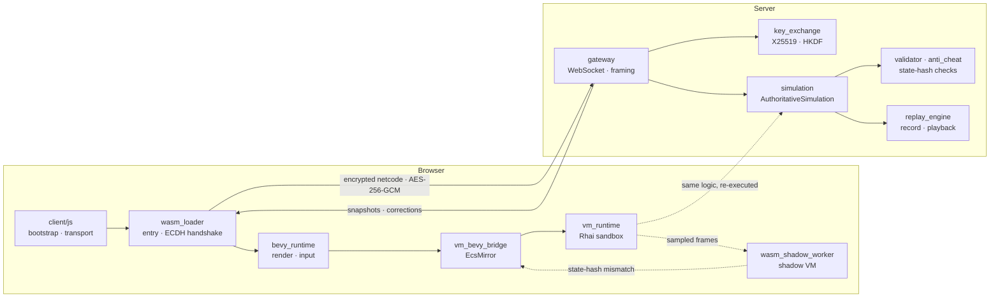
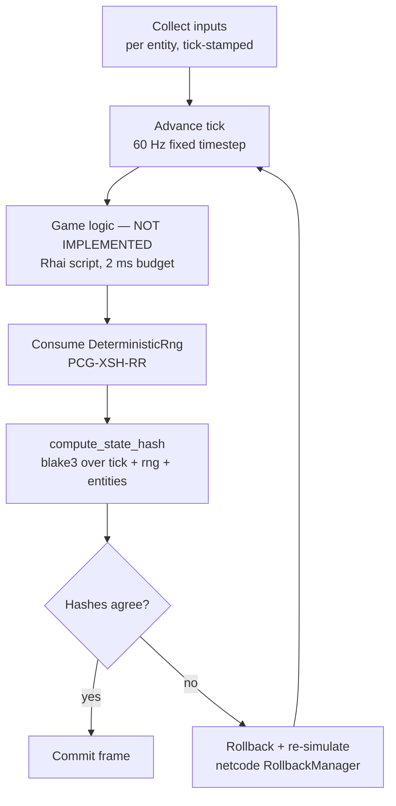
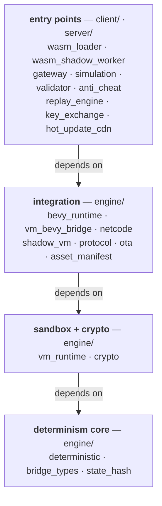
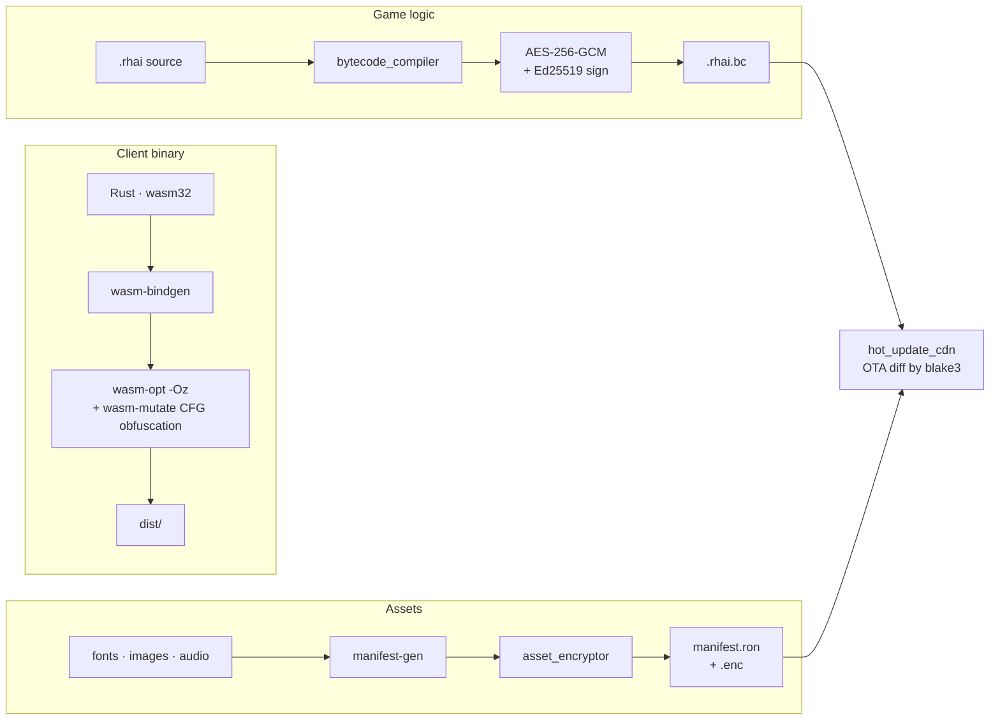

# bevy-personal-test


A deterministic multiplayer game **framework** in Rust: **Bevy** for rendering
and **Rhai** for game logic, where the logic runs inside a sandboxed script VM
so that a server and a second in-browser VM can independently re-execute it and
compare state hashes.

The anti-cheat and determinism plumbing is built first; the game that would sit
on top of it is not. See [Status](#status).

## Status

| Working today | Not built yet |
| --- | --- |
| Client boot pipeline, WASM + native, welcome screen | Any gameplay |
| Determinism primitives, state hashing, script sandbox | Game logic — 3 files carry `TODO(game-logic)` |
| Rollback/replay, authoritative loop, shadow-VM plumbing | Shipped `.rhai` scripts — `scripts/rhai/` is empty |

32 crates across `engine/` (12), `server/` (8), `client/` (3), `build/` (4),
`tools/` (6).

## Demo

Three ways to run this without a checkout-and-configure session.

### Browser — client boot pipeline

**[Live demo](https://xx-batsu.github.io/bevy-personal-test/)** — a static WASM
build on GitHub Pages. It executes the real client startup path (WASM
instantiate → Bevy engine init → first frame) and renders the welcome screen.
No gateway server sits behind it, so the client starts in offline mode: no
WebSocket, no ECDH handshake, no netcode session. Locally, append `?offline` to
any dev URL for the same behaviour.

### Terminal — determinism, state hashing, sandbox

The `demo` CLI exercises the guarantees the framework is built around. No
assets, no server, no browser:

```bash
cargo run -p demo_cli --release                     # all four sections
cargo run -p demo_cli --release -- --only sandbox   # one section
cargo run -p demo_cli --release -- --ticks 32       # longer hash chain
```

```
== 3. State hash chain — blake3 over (tick, rng state, entities) ==
  tick   1  blake3:fb8129b25c8424be…  seed42-rerun: match  seed43: diverged
  tick   2  blake3:ad8290c72f625e5a…  seed42-rerun: match  seed43: diverged
  seed 42 replay is bit-identical: true
  seed 43 diverges from tick 1

== 4. Rhai sandbox — symbol blocking and resource limits ==
  plain arithmetic   -> allowed, result = 45
  eval()             -> rejected (CompileError)
  module import      -> rejected (CompileError)
  unbounded loop     -> rejected (Timeout)
  limits: 50,000 ops, 32 call levels, 4 KiB strings, 2 ms per script.
```

Sections 1 and 2 cover `SoftF32` bit-reproducibility and `DeterministicRng`
state restore. Section 3 supplies its own minimal game logic, because
`AuthoritativeSimulation::step_full` deliberately leaves that as an insertion
point.

### Desktop — native window

Prebuilt binaries for Linux, macOS (Apple silicon) and Windows are attached to
each [release](https://github.com/XX-Batsu/bevy-personal-test/releases). Unpack
and run `native_dev`; keep `assets/fonts/` beside the executable or the CJK line
will not render. From a checkout, `just dev-native` does the same.

## How it fits together

Two independent re-executions of the same logic, compared by hash. The client
predicts, the server is authoritative, and a shadow VM in a separate Web Worker
audits sampled frames from inside the browser.



### One simulation frame

Every box below is deterministic: same inputs and seed produce a bit-identical
`blake3` hash on any platform. The game-logic slot is the part that is still
empty.



## Workspace

Four layers, read top to bottom: each layer may depend on the ones below it,
never the reverse. The bottom layer is what the determinism rules are enforced
against.



Determinism rules are enforced against L1–L3 only; `bevy_runtime` sits in L3 but
is exempt, because the render layer is allowed native floats.

`build/` holds compile-time tooling (`bytecode_compiler`, `asset_encryptor`,
`cfg_mutator`, `build_utils`); `tools/` holds CLIs (`demo_cli`,
`replay_debugger`, `state_inspector`, `vm_disassembler`, `manifest-gen`,
`dev-asset-server`) plus the determinism and golden-hash scripts.

<details>
<summary><b>Crate reference</b> — what each one is responsible for</summary>

| Crate | Layer | Purpose |
| --- | --- | --- |
| `deterministic` | L1 | Determinism primitives — `SoftF32`, `DeterministicRng`, `Clock` |
| `bridge_types` | L1 | Shared VM–ECS types — `EcsMirror`, `DeterministicValue` |
| `state_hash` | L1 | blake3 state hashing |
| `vm_runtime` | L2 | Sandboxed Rhai runtime with per-frame budgets |
| `crypto` | L2 | AES-256-GCM, X25519, Ed25519, HKDF |
| `vm_bevy_bridge` | L3 | VM–ECS bridge — `BridgePlugin`, flush systems |
| `bevy_runtime` | L3 | Bevy integration — plugins, camera, asset import |
| `netcode` | L3 | Rollback netcode + deterministic replay |
| `shadow_vm` | L3 | Shadow VM anti-cheat verification |
| `protocol` | L3 | Network protocol definitions and framing codec |
| `asset_manifest` · `ota` | L3 | Manifest parsing, OTA diffing and update management |
| `wasm_loader` | L4 | Browser entry point and key exchange |
| `wasm_shadow_worker` | L4 | Shadow VM Web Worker |
| `gateway` · `key_exchange` | L4 | WebSocket gateway, ECDH handshake |
| `simulation` · `validator` · `anti_cheat` | L4 | Authoritative loop and state-hash validation |
| `replay_engine` · `hot_update_cdn` | L4 | Replay record/playback, OTA bytecode distribution |

</details>

## Build pipeline

Scripts and assets never ship in the clear, and the WASM binary is reshaped at
build time so that two releases do not share a control-flow graph.



## Quick Start

```bash
just download-fonts      # first run: fetch CJK fonts (embedded at compile time)
just manifest            # first run: generate the asset manifest
just dev-native          # native dev mode (recommended for daily iteration)
just dev                 # WASM dev mode (full browser pipeline)
just demo                # terminal demo (determinism / hashing / sandbox)
just stop                # stop all background services
```

```bash
cargo test                    # unit tests
cargo fmt --check             # formatting
cargo clippy -- -D warnings   # lint
```

`justfile` targets zsh and macOS paths; CI uses `tools/ci_fonts.sh` instead.

## Technical Decisions

| Area                | Choice                                              |
| ------------------- | --------------------------------------------------- |
| Game engine         | Bevy (WASM target)                                  |
| Script engine       | Rhai (pure Rust, sandboxed)                         |
| Hash                | blake3                                              |
| Float determinism   | `SoftF32` (game logic), native float (render layer) |
| RNG                 | PCG-XSH-RR, seeded                                  |
| Fixed timestep      | 60 Hz logic, interpolated rendering                 |
| Script budget       | 2 ms per script, 4 ms per frame                     |
| Symmetric crypto    | AES-256-GCM                                         |
| Key exchange        | X25519 ECDH + HKDF-SHA256                           |
| Signing             | Ed25519                                             |
| CFG obfuscation     | wasm-mutate (build time)                            |
| Serialization       | bincode                                             |
| WASM memory cap     | 512 MB                                              |

<details>
<summary><b>Determinism rules</b> — enforced by <code>tools/check_determinism.sh</code> in CI</summary>

- No `HashMap`/`HashSet` in game logic — `BTreeMap`/`BTreeSet`/`IndexMap` only
- No native `f32`/`f64` in game logic — `SoftF32` only
- No `std::time` in state computation — frame counters and the `Clock` trait
- All randomness through the seeded `DeterministicRng`
- Deterministic iteration order everywhere; `#[repr(C)]` for serialized state
- No async in the simulation step

The scan covers `deterministic`, `state_hash`, `vm_runtime`, `netcode`,
`vm_bevy_bridge`, `shadow_vm`, `bridge_types` and `crypto`. `bevy_runtime` is
excluded: the render layer is allowed native floats. Per-file exemptions are
listed with a reason in the script.

</details>

<details>
<summary><b>WASM constraints</b></summary>

- No `std::thread` — Web Workers via `wasm-bindgen`
- No `std::time::Instant` — `web_sys::Performance` instead
- No `std::fs` — all assets fetched over HTTP and decrypted in memory
- `panic = "abort"` in release; `tracing` macros instead of `println!`
- Total WASM memory ≤ 512 MB

</details>

<details>
<summary><b>Security model</b></summary>

- Rhai scripts run in a sandbox: no filesystem, network, or `eval`; opcode
  budgets and scope limits are enforced per frame
- Assets and script bytecode are AES-256-GCM encrypted, Ed25519 signed, with
  session keys derived via X25519 ECDH + HKDF-SHA256
- A shadow VM in a separate Web Worker re-executes sampled frames and
  compares blake3 state hashes for anti-cheat validation

</details>

<details>
<summary><b>Asset management</b></summary>

External binary assets (fonts, images, audio) are not committed to git; they
are fetched by `just` recipes (e.g. `just download-fonts`) and, where needed
at compile time via `include_bytes!`, guarded by `build.rs` checks that fail
fast with an actionable message.

</details>

## License

MIT — see [LICENSE](LICENSE).

This project is an independent work built on the [Bevy](https://bevyengine.org)
game engine and is not affiliated with or endorsed by the Bevy Foundation.
